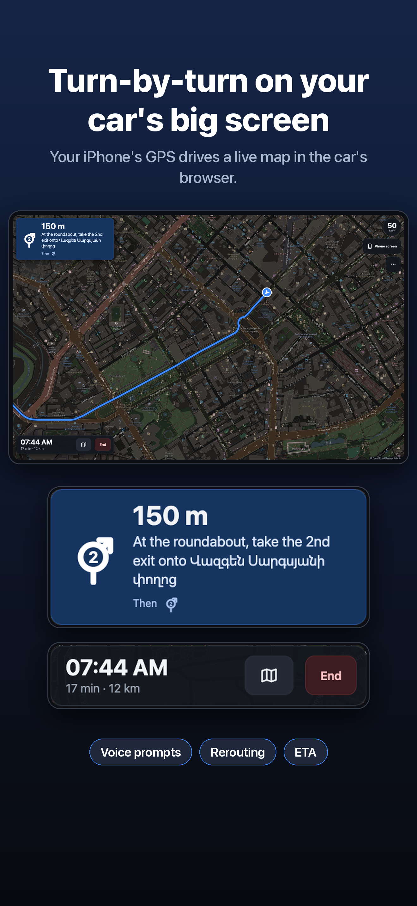

# TeslaNav

Turn on the iPhone hotspot, open one bookmark in the Tesla browser, get navigation on the car
screen. No hosting, no accounts, no cloud: the iPhone app serves everything at
`http://172.20.10.1:8080`.

- **Map mode** — dark map, search, turn-by-turn, voice prompts, rerouting and ETA, driven by the
  iPhone's GPS.
- **Mirror mode** — the whole iPhone screen streamed to the car (ReplayKit → MJPEG), so Yandex
  Navigator, Google Maps or Waze can be used with live traffic.
- One button in the car switches between them. Keeps serving with another app in front or the
  phone locked (background location keeps the app alive).

Support: https://hakob17.github.io/teslanav/ · Privacy: https://hakob17.github.io/teslanav/privacy.html



## Layout

| File | Target | Responsibility |
|---|---|---|
| `Sources/TeslaNavApp.swift` | App | Entry, `AppModel`, status UI, hotspot IP lookup, Start Broadcast button |
| `Sources/WebServer.swift` | App | `NWListener` HTTP server on :8080, routing, MJPEG with backpressure, auto-restart |
| `Sources/LocationService.swift` | App | `CLLocationManager` at navigation accuracy, background updates, fix as JSON |
| `Sources/FrameStore.swift` | App | Polls the App Group every 30 ms, keeps newest frame + sequence, "live" flag |
| `Sources/Tips.swift` | App | "Buy me a coffee" tip (consumable in-app purchase) |
| `Broadcast/SampleHandler.swift` | Extension | ReplayKit: orient, downscale to 1280 px, JPEG 0.55, 15 fps, atomic write, heartbeat |
| `Shared/Shared.swift` | Both | App Group ID, extension bundle ID, file paths, frame settings |
| `Resources/web/index.html` | Bundle | Car page: Leaflet map, Nominatim search, OSRM routing, guidance, voice, simulator, mirror view |
| `Resources/web/leaflet.{js,css}` | Bundle | Leaflet 1.9.4, served locally |
| `project.yml` | Build | XcodeGen spec: two targets, App Group, Info.plist keys |
| `docs/` | Pages | Support and privacy pages (GitHub Pages) |
| `design/` | — | Icon and App Store screenshot generators (`make_icon.py`, `shoot.mjs`, `make_screenshots.py`) |

Endpoints: `/` (page), `/loc` (`{ok, lat, lng, speed, course, acc, ts, age}`), `/status`
(`{mirror}`), `/mjpeg` (`multipart/x-mixed-replace`).

## Build and install

```bash
xcodegen generate
open TeslaNav.xcodeproj
```

Pick your iPhone, run the **TeslaNav** scheme. Automatic signing with team `SXEFA57E5G`
registers the App Group `group.com.hakobhakobyan.teslanav` for both targets on first build.

## Use

1. Personal Hotspot on; join it from the car's Wi-Fi.
2. Open TeslaNav once (allow location — "While Using" is enough).
3. In the Tesla browser open `http://172.20.10.1:8080` and bookmark it.
4. Mirror mode: tap **Start Broadcast** in the app, then **Phone screen** in the car.

## Support

No ads, no accounts, no backend. A **Buy me a coffee** button on the iPhone status screen is a
consumable in-app purchase (`com.hakobhakobyan.teslanav.coffee`, StoreKit 2) that can be bought
any number of times and unlocks nothing — Apple handles the payment. `TeslaNav.storekit` makes it
testable when you run from Xcode (Debug only). Before release, create the consumable in App Store
Connect and set its price (the local file uses $2.99).

## Testing at a desk

The server runs in the iOS Simulator too, on the Mac's `localhost:8080`:

```bash
xcrun simctl location booted set 40.1811,44.5136
```

Open `http://localhost:8080` in a browser, search a place, then **⋯ → Simulate drive** to drive
the route at 50 km/h with banners, voice and ETA. ReplayKit doesn't run in the Simulator; to test
the MJPEG path, write `frame.jpg` and touch `heartbeat` in the app's App Group container
(`xcrun simctl get_app_container booted com.hakobhakobyan.teslanav group.com.hakobhakobyan.teslanav`).

## Known limits

- Map tiles: CARTO's dark tiles now need an API key, so the page uses OpenStreetMap tiles with a
  night filter (fine for personal use under OSM's tile policy) and offers Esri Dark Gray as a
  keyless fallback in the ⋯ menu.
- Routing and search use the public OSRM and Nominatim demo servers: no traffic, fair-use limits.
- The Tesla browser may have no speech voices; banners still work without them.
- Browser geolocation fallback only works on secure origins (localhost), not over the hotspot.
- The broadcast extension has a ~50 MB memory cap; frames are encoded one at a time and dropped
  when behind.
